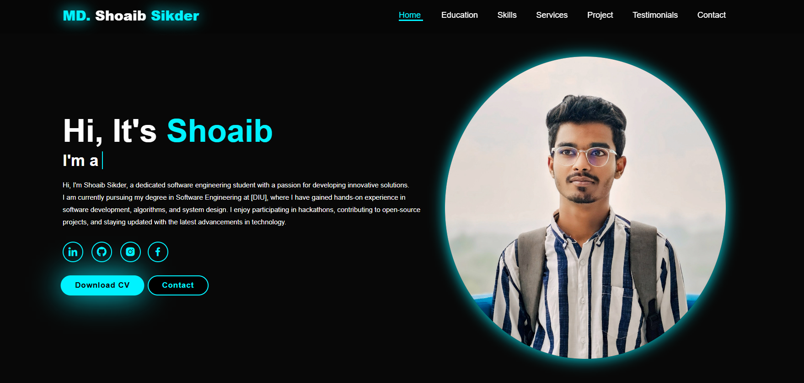

# 💼 Personal Portfolio - MD. Shoaib Sikder

## 📸 Preview

Welcome to my personal responsive portfolio website!  
This is a fully responsive web portfolio built using **HTML**, **CSS**, and **JavaScript**, designed to showcase my skills, education, services, projects, and contact details in a clean and modern layout.

## 🔗 Live Preview

[🌐 Visit My Portfolio](https://shoaibsikder.github.io/My-Portfolio/)

---

## 📂 Features

✅ Responsive Design (Mobile, Tablet & Desktop)  
✅ Hero Section with Typing Animation  
✅ Download CV and Contact Buttons  
✅ Linked Social Icons  
✅ Smooth Scrolling Navigation  
✅ Clean & Modern UI  
✅ Scroll Animations using AOS or JavaScript

---

## 🧰 Technologies Used

- HTML5
- CSS3
- JavaScript
- Font Awesome / Boxicons
- Google Fonts
- VS Code (Editor)
